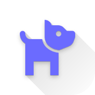
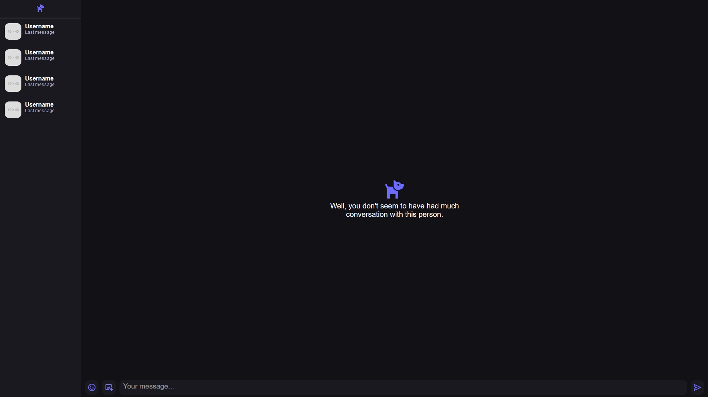

<div align="center">
    
    <h3>Doggo</h3>
    <p><em>Your local website ready for self-hosted or deployed use. </em></p>
</div>
<div align="right">


</div>

# Doggo - local conversation
a little project of my own which you are free to help create and improve.

## Technology we use
- Front-End : HTML, SCSS, JAVASCRIPT
- Back-End : PHP
- *Docker (future)*

## Installation
1. Clone the repository 
```sh
git clone https://github.com/kerogs/doggo.git
```
2. host the site (xampp, wamp, mamp, lamp ...) 
3. Ready To Use.

## To do
- [ ] Add friends
- [ ] Create groups
- [ ] Create account / login
- [ ] Add custom emojis to the site
- [ ] Send images
- [ ] React to the message
- [ ] Displayed when a message is read or not
- [ ] Add 
- [ ] Responsive
- [ ] Manifest.json (for PWA)
- [ ] Make it an application windows/linux/MacOS (connect to the website)
- [ ] Make an apk (connect to the website)

## Previews
